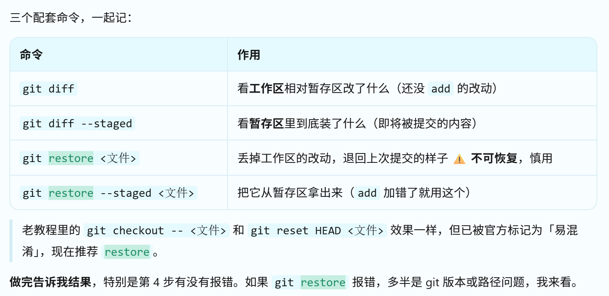

# 桌面项目笔记

## day-1

### git与github的区分


### git的使用

| 你做的事                                 | 发生了什么                          |              git 的反应              |
| :--------------------------------------- | :---------------------------------- | :----------------------------------: |
| 在 VS Code 里改代码，按 **Ctrl+S**       | 文件内容被写进硬盘的那个 `.py` 文件 | **什么都没做**。它只是"看到"文件变了 |
| 敲 `git add` / `git commit` / `git push` | 主动下令                            |             执行对应动作             |

### VS Code 里改代码，怎么存到 git


## 代码修改步骤

1.改代码，按 **Ctrl+S**

验收结果：左侧竖排图标里那个**分叉树枝形状**的图标（源代码管理，快捷键 Ctrl+Shift+G）上会出现数字角标；面板里 `hello.py` 旁边标着 **M**（Modified = 已修改）。

2.查看修改：

```python
git status
git diff
```

3.放进暂存区

```
git add 文件名
```

**预期**：**无输出**（git add 成功时是静默的，这点常让人以为失败了）。再跑 `git status`，会看到 `Changes to be committed` 下面出现 `hello.py`，标记 **A**。

4.commit（存成快照）

```
git commit -m "docs: 修改 hello.py 的问候语"
```


5.push（上传到本地）

```
git push
```

**预期**：输出 `xxx..yyy main -> main`。然后打开 github网页才能看到

6.


==注意==：

1. 如果 `git diff` 输出后光标卡住不动、底部显示 `:` 或 `(END)`，**按 `q` 退出** —— 那是 git 的分页器（less），不是卡死。
2. 

### 三个git命令



## day-2

### 学习的python语法

| #    | 语法                            | 要会做的事                                 | 最小示例                                                     |
| :--- | :------------------------------ | :----------------------------------------- | :----------------------------------------------------------- |
| 1    | `list` 列表                     | 建空表、追加、看长度、按下标取             | `todos = []` / `todos.append(项)` / `len(todos)` / `todos[0]` |
| 2    | `dict` 字典                     | 用键取值、改值、给默认值                   | `{"id": 1, "title": "写 README", "done": False}` / `t["title"]` / `t["done"] = True` / `t.get("x", "")` |
| 3    | list 套 dict                    | 一个待办 = 一个 dict，全部待办 = 一个 list | 这是本项目的核心数据结构                                     |
| 4    | `while True` + `break`          | 让程序一直转，输 `quit` 才退出             | `while True:` / `break` / `exit()`                           |
| 5    | `input()` + `.strip()`          | 收用户输入，去掉首尾空格                   | `raw = input("> ").strip()`                                  |
| 6    | f-string                        | 拼显示文本，**注意引号嵌套**               | `f"{i}. {t['title']}"`                                       |
| 7    | 字符串切分 `.split(maxsplit=1)` | 从 `"add 写README"` 拆出命令和内容         | `cmd, _, text = raw.partition(" ")`                          |
| 8    | `if __name__ == "__main__":`    | Day1 学过，继续当入口守卫                  | 末尾调用 `main()`                                            |